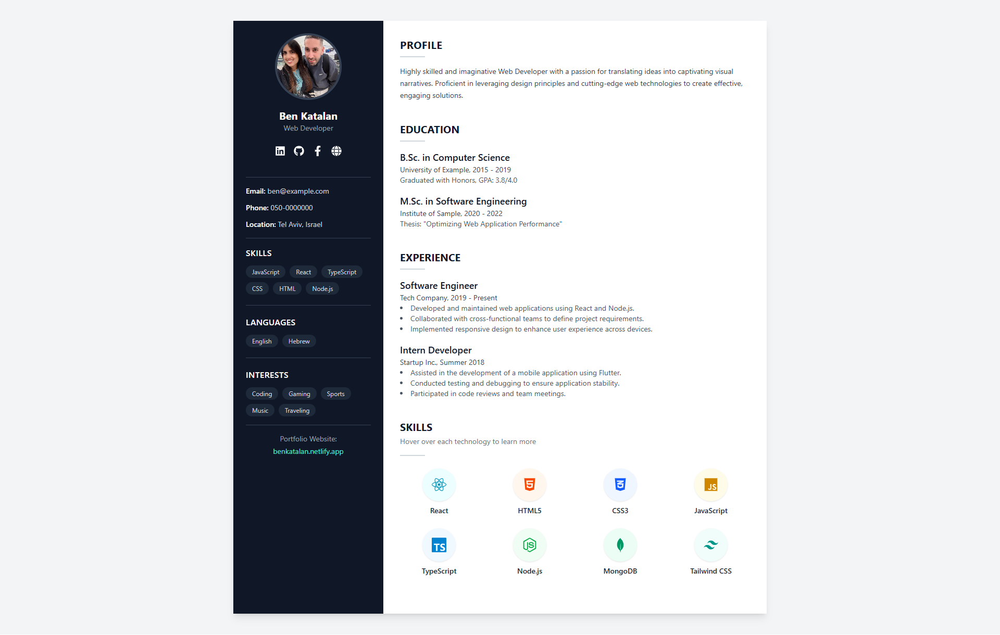

# React Resume

A clean and modern personal resume template built with **React**, **TypeScript**, and **TailwindCSS**.  
Fully responsive and easy to customize for your own personal profile.

---

## 📸 Preview


---

## 🚀 Features
- Fully responsive design
- Clean, modern layout
- Easy to customize text, images, and styles
- Built with React + TypeScript + TailwindCSS

---

## 📦 Installation

1. **Clone the repository**
```bash
git clone https://github.com/KtLN2k/React-Interactive-Resume.git
cd react-resume
```

2. **Install dependencies**
```bash
npm install
```

3. **Run the development server**
```bash
npm run dev
```

4. **Open in browser**
```bash
http://localhost:5173
```

---

## 🛠 Customization
- **Profile Picture**: Replace `src/assets/profile-img.jpg` with your own image.
- **Personal Info**: Update `Header.tsx` with your name, title, contact info, and links.
- **Profile / Experience / Education**: Edit the relevant components inside `src/components`.
- **Skills**: Modify the `Skills.tsx` component to reflect your skills.

---

## 🌐 Live Demo
[**View Live on Netlify**](https://react-interactive-resume.netlify.app)

---

## 📄 License
This project is open source and free to use.
